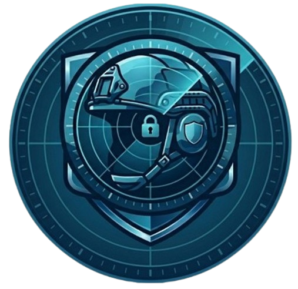

# AEGIS Treasure Hunt 

> **Projet de Fin d'Études — Promotion 2025/2026**  
> Chasse au trésor numérique à scénario immersif sur infrastructure simulée



---

## Présentation

AEGIS Treasure Hunt est un CTF (*Capture The Flag*) pédagogique conçu dans le cadre du PFE 2025/2026. Il met les étudiants dans la peau d'analystes cyber de la DGSI chargés de retrouver les preuves cachées par Thomas LALIMACE, ingénieur réseau disparu après avoir découvert une compromission grave des systèmes de communication militaires livrés par AEGIS Technologies.

Le module HERMES-v4.1, officiellement présenté comme un système de communication sécurisé pour les forces armées, exfiltre en réalité les données interceptées vers Kronitel Holdings SA — une société privée non référencée dans les contrats officiels. Thomas a découvert la vérité, tenté de la signaler, et a disparu.

---

## Objectifs pédagogiques

| Compétence | Outil utilisé |
|---|---|
| Reconnaissance réseau | `nmap` |
| Énumération de répertoires | `ffuf` |
| Extraction de données cachées | `steghide` |
| Analyse de fichiers binaires | `strings` |
| Exploitation web | Injection SQL manuelle |
| Connexion distante | SSH + SCP |
| Analyse de trafic réseau | `Wireshark` |

---

## Structure du dépôt

```
aegis-treasure-hunt/
│
├── README.md
│
├── site-web/                          ← Site AEGIS public (port 80)
│   ├── index.html                     ← Page d'accueil + profil Thomas
│   └── assets/
│       └── style.css
│
├── intranet/                          ← Espace collaborateur (port 80)
│   ├── login.php                      ← Connexion Thomas (SQLi volontaire)
│   ├── dashboard.php                  ← Dashboard (tickets, notes, documents)
│   ├── logout.php
│   ├── admin/
│   │   ├── index.php                  ← Login admin (SQLi bypass)
│   │   └── panel.php                  ← Panneau admin + recherche injectable
│   └── documents/
│       ├── notes_perso.txt            ← Pense-bête SSH ("nomChat + monMatricule")
│       ├── reunion_03.jpg             ← Image stéganographiée (steghide)
│       └── reunion_confidentielle_20052026.wav  ← Audio (strings)
│
├── bdd/                               ← Base de données MySQL
│   └── setup_mysql.sql                ← Script création + peuplement
│
├── captures/                          ← Captures réseau HERMES
│   └── cp-Hermes02.pcap               ← Capture réseau (Wireshark)
│
├── pcap/                              ← Script de génération du PCAP
│   └── create_pcap.py                 ← Génère cp-Hermes02.pcap avec scapy
│
├── submit/                            ← Page de soumission finale (port 8080)
│   └── app.py
│
├── thunderbird/                       ← Profil Thunderbird préconfiguré
│   └── profile/                       ← À copier sur les VM Kali étudiants
│
└── deploy/                            ← Scripts d'installation
    └── deploy.sh                      ← Déploiement complet en une commande
```

---

## Architecture technique

```
┌──────────────────── Réseau host-only — 192.168.56.0/24 ────────────────────┐
│                                                                            │
│  ┌─────────────────┐                  ┌─────────────────────────────────┐  │
│  │  Kali Linux     │                  │  VM Ubuntu — Serveur AEGIS      │  │
│  │  192.168.56.5   │ ◄──────────────► │  192.168.56.42                  │  │
│  │                 │                  │                                 │  │
│  │  nmap           │                  │  :80    Apache + PHP + MySQL    │  │
│  │  ffuf           │                  │  :2222  SSH (mot de passe)      │  │
│  │  steghide       │                  │                                 │  │
│  │  strings        │                  │  :3306  MySQL                   │  │
│  │  scp            │                  │  :8080  Page soumission         │  │
│  │  ssh            │                  │                                 │  │
│  │  Wireshark      │                  │                                 │  │
│  └─────────────────┘                  └─────────────────────────────────┘  │
│                                                                            │
└────────────────────────────────────────────────────────────────────────────┘
```
## Installation

### Prérequis

- VirtualBox (ou VMware)
- VM Ubuntu Desktop 24.04 — 2 CPU, 4 Go RAM minimum
- Réseau configuré en **host-only** dans VirtualBox
- VM Kali Linux pour les étudiants

### Déploiement en une commande

```bash
cd aegis-treasure-hunt/deploy
sudo bash deploy.sh
```

## Comment jouer ?

1. Démarrez la VM Serveur (Ubuntu) et la VM Attaquant (Kali).
2. Assurez-vous que vous pouvez "pinger" l'IP `192.168.56.42`.
3. Commencez par analyser l'e-mail reçu dans le client **Thunderbird** (profil fourni dans `/thunderbird`) pour obtenir votre premier indice.

## Avertissement

> Ce projet est conçu exclusivement à des fins pédagogiques dans un environnement réseau isolé (host-only). Les vulnérabilités introduites sont volontaires et ne doivent jamais être déployées sur un réseau accessible. Ne pas connecter la VM serveur à internet.


## Informations projet

| | |
|---|---|
| Établissement | ESIEE-IT |
| Membres | Malika, Sofia, Nirmala, Jennifer, Sofiane, Hawa |
| Année | 2025 / 2026 |
| Type | Projet de Fin d'Études |
| Sujet | Treasure Hunt Numérique |